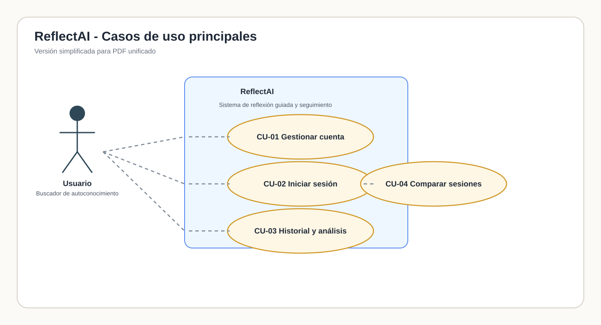
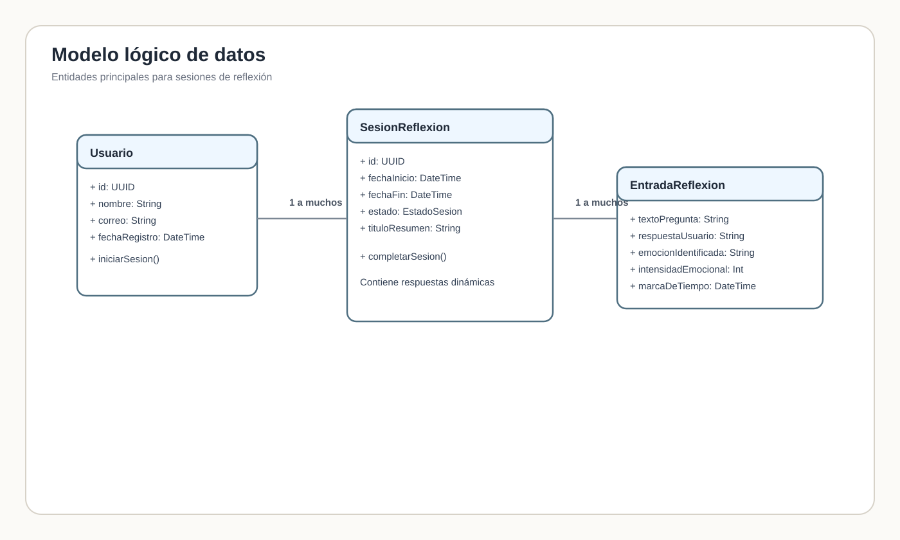
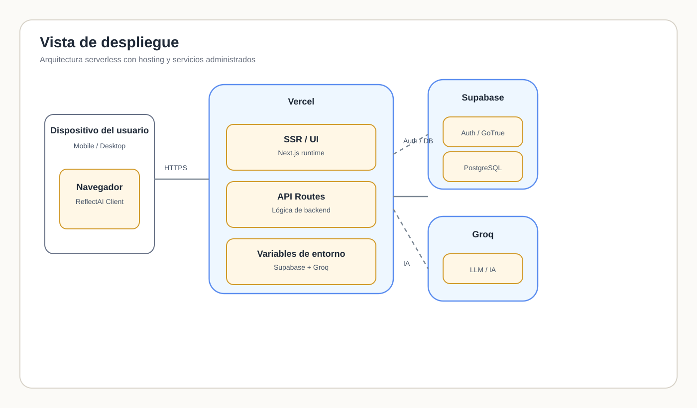
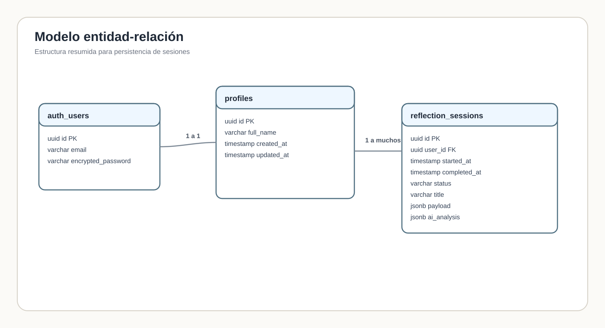

= Diseño
:icons: font

== Diseño arquitectónico
ReflectAI se apoya en un esquema serverless con autenticación administrada, persistencia en PostgreSQL y un motor de IA externo para generar el flujo guiado de reflexión.

La intención de este documento es mostrar la arquitectura de forma legible en PDF, por lo que los diagramas se incluyen como imágenes vectoriales ya renderizadas.

== Vista de casos de uso (diagrama uml de casos de uso)
Resumen visual de las interacciones clave entre el usuario y el sistema.

== Vista lógica (diagrama uml de clases)
Modelo lógico con las entidades principales y su relación.

== Vista de despliegue (diagrama uml de despliegue)
Componentes de infraestructura y sus vínculos de comunicación.

== Modelo de datos (diagrama de entidad-relación)
El modelo mezcla tablas relacionales para identidad y perfil con una carga JSONB flexible para las sesiones de reflexión.

=== Diccionario de datos
Las estructuras clave que persisten en la base de datos son las siguientes:

[cols="1,3", options="header"]
|===
| Elemento | Uso
| `payload` | Secuencia ordenada de preguntas, respuestas, emoción detectada e intensidad emocional de cada paso.
| `ai_analysis` | Resumen calculado para análisis posterior: emociones principales, intensidad promedio, temas y distorsiones detectadas.
|===

`reflection_sessions` guarda una sesión por usuario con estado `draft` o `completed`. `profiles` conserva los datos visibles del usuario y `auth_users` queda delegada a la capa de autenticación.

== Descripciones de casos de uso
Se detallan los flujos principales para asegurar cobertura completa del comportamiento esperado.
=== CU-01: Gestionar Cuenta

[cols="1,2", options="header"]
|===
| Atributo | Descripción
| *ID* | CU-01
| *Nombre* | Gestionar Cuenta
| *Autor* | Equipo de Requisitos ReflectAI
| *Fecha* | 2026-04-27
| *Descripción Corta* | El paciente puede registrarse, autenticarse, recuperar contraseña y eliminar su cuenta junto con todos sus datos personales.
| *Actor Primario* | Paciente / Usuario Final
| *Trigger (Disparador)* | El usuario accede a la aplicación sin estar autenticado o desea gestionar su cuenta.
| *Precondiciones* | Ninguna (para registro). Usuario autenticado (para modificar o eliminar cuenta).
| *Flujo Normal* | 
1. El usuario elige la opción "Registrarse" o "Iniciar Sesión".
2. El sistema presenta un formulario con campos: correo electrónico y contraseña.
3. El usuario completa los datos y presiona "Continuar".
4. El sistema valida que el correo sea válido y único.
5. El sistema hasea la contraseña y crea la cuenta.
6. Se genera un token JWT con tiempo de expiración de 24 horas.
7. El sistema redirige al usuario a la página principal (Dashboard).
| *Flujos Alternativos* |
*Alternativa A1: Correo ya registrado*
- Si el correo ya existe, el sistema muestra: "Este correo ya está asociado a una cuenta".
- El usuario puede optar por "Recuperar Contraseña" o intentar con otro correo.

*Alternativa A2: Contraseña débil*
- Si la contraseña tiene menos de 8 caracteres o no cumple criterios de seguridad, el sistema avisa: "La contraseña debe tener al menos 8 caracteres, incluir mayúsculas, números y caracteres especiales".
| *Flujos de Excepción* |
*Excepción E1: Error en base de datos*
- Si hay un error al almacenar la cuenta, el sistema muestra: "Hubo un error al crear tu cuenta. Por favor, intenta nuevamente."
- El usuario puede reintentar.

*Excepción E2: Sesión expirada*
- Si el JWT expira, el usuario es desconectado y debe iniciar sesión nuevamente.
| *Postcondiciones* | La cuenta del usuario está creada y activa. El usuario recibe un token de sesión válido. El perfil del usuario se sincroniza con la base de datos.
| *Reglas de Negocio* |
* RNF-01: Todas las contraseñas deben estar hasheadas usando bcrypt o similar.
* RNF-02: Las comunicaciones deben estar cifradas obligatoriamente mediante HTTPS/SSL.
* RES-01: Al registrarse, el sistema debe mostrar de forma obligatoria un aviso legal indicando que ReflectAI no es una herramienta clínica.
* Los tokens JWT deben tener tiempo de expiración de máximo 24 horas.
|===

---

=== CU-01.1: Autenticarse

[cols="1,2", options="header"]
|===
| Atributo | Descripción
| *ID* | CU-01.1
| *Nombre* | Autenticarse (Iniciar Sesión)
| *Autor* | Equipo de Requisitos ReflectAI
| *Fecha* | 2026-04-27
| *Descripción Corta* | El usuario ingresa con sus credenciales (correo y contraseña) o a través de proveedores externos (Google, Apple) para acceder a su cuenta.
| *Actor Primario* | Paciente / Usuario Final
| *Trigger (Disparador)* | El usuario accede a la aplicación sin sesión activa.
| *Precondiciones* | El usuario debe tener una cuenta registrada. La plataforma debe estar disponible.
| *Flujo Normal* |
1. El usuario ingresa a la página de login.
2. El sistema presenta el formulario con campos: correo y contraseña.
3. El usuario completa los datos.
4. El usuario presiona "Iniciar Sesión".
5. El sistema valida las credenciales contra la base de datos.
6. Si son correctas, genera un token JWT.
7. El usuario es redirigido al Dashboard.
8. Su sesión se mantiene activa durante 24 horas.
| *Flujos Alternativos* |
*Alternativa A1: Autenticación con Google*
- El usuario presiona el botón "Continuar con Google".
- Se abre el flujo OAuth de Google.
- El usuario autoriza el acceso a su cuenta.
- Si el correo de Google no existe en ReflectAI, se crea una cuenta automáticamente.
- Se genera el token JWT.

*Alternativa A2: Autenticación con Apple*
- Mismo flujo que Google, pero con el proveedor Apple.
| *Flujos de Excepción* |
*Excepción E1: Credenciales incorrectas*
- El sistema muestra: "Correo o contraseña incorrectos".
- Se permite reintentar sin límite de intentos (en fase inicial; implementar rate limiting en producción).

*Excepción E2: Cuenta desactivada*
- Si el usuario eliminó su cuenta previamente, el sistema muestra: "Esta cuenta ha sido desactivada".

*Excepción E3: Error en servicio OAuth*
- Si hay un error con el proveedor (Google, Apple), se muestra: "No se pudo conectar con el servicio. Por favor, intenta con tus credenciales directas".
| *Postcondiciones* | El usuario tiene una sesión activa. El token JWT se almacena en el navegador (httpOnly cookie). El usuario accede a todas las funcionalidades de la aplicación.
| *Reglas de Negocio* |
* RNF-01: La contraseña nunca se almacena en texto plano.
* RNF-03: El tiempo de autenticación no debe superar los 500 ms.
* RFC-2: Implementar rate limiting para prevenir ataques de fuerza bruta (máximo 5 intentos fallidos por hora).
|===

---

=== CU-01.2: Recuperar Contraseña

[cols="1,2", options="header"]
|===
| Atributo | Descripción
| *ID* | CU-01.2
| *Nombre* | Recuperar Contraseña
| *Autor* | Equipo de Requisitos ReflectAI
| *Fecha* | 2026-04-27
| *Descripción Corta* | El usuario que olvidó su contraseña puede solicitar un enlace de restablecimiento por correo electrónico.
| *Actor Primario* | Paciente / Usuario Final
| *Trigger (Disparador)* | El usuario no recuerda su contraseña y accede a la opción "¿Olvidaste tu contraseña?" en el login.
| *Precondiciones* | El usuario debe tener una cuenta registrada. El sistema de envío de correos debe estar disponible.
| *Flujo Normal* |
1. El usuario presiona "¿Olvidaste tu contraseña?" en la página de login.
2. El sistema presenta un campo para ingresar el correo electrónico.
3. El usuario ingresa su correo y presiona "Enviar enlace de recuperación".
4. El sistema valida que el correo exista en la base de datos.
5. Se genera un token temporal (válido por 1 hora) y se envía un correo con un enlace.
6. El enlace redirige al usuario a una página de "Restablecer Contraseña".
7. El usuario ingresa una nueva contraseña y la confirma.
8. El sistema valida la nueva contraseña.
9. Se actualiza la contraseña en la base de datos (hasheada).
10. El sistema muestra: "Tu contraseña ha sido restablecida exitosamente".
| *Flujos Alternativos* |
*Alternativa A1: Correo no encontrado*
- Si el correo no existe, el sistema muestra: "No encontramos una cuenta con este correo" (sin revelar si existe por seguridad).

*Alternativa A2: Enlace expirado*
- Si el usuario intenta acceder al enlace después de 1 hora, el sistema muestra: "Este enlace ha expirado".
- El usuario debe solicitar un nuevo enlace.
| *Flujos de Excepción* |
*Excepción E1: Error al enviar correo*
- Si el servicio de correo falla, el sistema muestra: "No pudimos enviar el correo. Por favor, intenta más tarde".

*Excepción E2: Contraseña nueva no cumple criterios*
- El sistema valida que cumpla requisitos y muestra: "La contraseña debe tener al menos 8 caracteres, mayúsculas, números y caracteres especiales".
| *Postcondiciones* | La contraseña del usuario ha sido restablecida. El usuario puede iniciar sesión con la nueva contraseña. El token temporal es invalidado.
| *Reglas de Negocio* |
* RNF-01: El token de recuperación tiene validez de máximo 1 hora.
* RNF-02: El correo debe ser enviado con protocolo seguro (SMTP con TLS).
* RFC-3: No revelar si un correo existe o no (por seguridad).
|===

---

=== CU-01.3: Eliminar Cuenta y Datos

[cols="1,2", options="header"]
|===
| Atributo | Descripción
| *ID* | CU-01.3
| *Nombre* | Eliminar Cuenta y Datos Personales
| *Autor* | Equipo de Requisitos ReflectAI
| *Fecha* | 2026-04-27
| *Descripción Corta* | El usuario autenticado puede solicitar la eliminación permanente de su cuenta y todos sus datos asociados (sesiones de reflexión, perfil, etc.).
| *Actor Primario* | Paciente / Usuario Final
| *Trigger (Disparador)* | El usuario accede a la sección de configuración y elige "Eliminar mi cuenta".
| *Precondiciones* | El usuario debe estar autenticado. Debe tener acceso a la página de configuración o ajustes de cuenta.
| *Flujo Normal* |
1. El usuario accede a "Ajustes de Cuenta" o "Configuración".
2. El usuario selecciona "Eliminar Cuenta Permanentemente".
3. El sistema muestra un aviso: "Esta acción es irreversible. Se eliminarán todos tus datos, sesiones y perfil."
4. El usuario debe confirmar su contraseña para proceder.
5. El usuario ingresa su contraseña y presiona "Confirmar Eliminación".
6. El sistema valida la contraseña.
7. Se programa la eliminación (puede ser inmediata o después de 30 días de período de gracia).
8. El usuario recibe un correo de confirmación: "Tu cuenta y datos han sido eliminados".
9. El usuario es desconectado automáticamente.
10. Los datos se borran de la base de datos (o se marcan como eliminados si aplica).
| *Flujos Alternativos* |
*Alternativa A1: Período de gracia de 30 días*
- En lugar de eliminar inmediatamente, el sistema marca la cuenta como "programada para eliminación".
- El usuario recibe correos de confirmación en días 1, 15 y 29.
- Si el usuario inicia sesión durante este período, la eliminación se cancela.

*Alternativa A2: Contraseña incorrecta*
- Si la contraseña no es válida, el sistema muestra: "Contraseña incorrecta. Por favor, intenta nuevamente".
- La eliminación no procede.
| *Flujos de Excepción* |
*Excepción E1: Error en base de datos durante eliminación*
- Si hay un error al eliminar los datos, el sistema muestra: "Hubo un error al procesar tu solicitud. Por favor, contáctanos".
- Se registra el error para revisión del equipo técnico.

*Excepción E2: Sesión perdida durante el proceso*
- Si la conexión se pierde durante la confirmación, el sistema requiere re-autenticación.
| *Postcondiciones* | La cuenta del usuario está marcada para eliminación o ha sido eliminada. Todos los datos personales, sesiones y perfil se eliminan de forma permanente. El usuario recibe un correo de confirmación.
| *Reglas de Negocio* |
* RES-02: El usuario debe confirmar su identidad mediante contraseña antes de proceder.
* RFC-4: Implementar período de gracia de 30 días antes de la eliminación real (recomendado para recuperación accidental).
* RFC-5: Mantener logs de auditoría indicando cuándo y por quién se eliminó una cuenta (cumplimiento GDPR).
|===

---

=== CU-02: Iniciar Sesión de Reflexión

[cols="1,2", options="header"]
|===
| Atributo | Descripción
| *ID* | CU-02
| *Nombre* | Iniciar Sesión de Reflexión
| *Autor* | Equipo de Requisitos ReflectAI
| *Fecha* | 2026-04-27
| *Descripción Corta* | El usuario autenticado inicia una nueva sesión de reflexión guiada, respondiendo a un flujo estructurado de preguntas basadas en el modelo ABC de TCC y conceptos de Psicología Adleriana.
| *Actor Primario* | Paciente / Usuario Final
| *Trigger (Disparador)* | El usuario presiona el botón "Iniciar Nueva Reflexión" en el Dashboard.
| *Precondiciones* | El usuario debe estar autenticado. La sesión debe estar activa. El servicio de IA (Groq) debe estar disponible.
| *Flujo Normal* |
1. El usuario presiona "Iniciar Nueva Reflexión".
2. El sistema crea una nueva sesión de reflexión con estado "draft".
3. Se presenta la Fase 1 (Contexto) con la pregunta Q1_SIT.
4. El usuario ingresa la descripción de la situación (tipo: texto largo).
5. El usuario presiona "Siguiente".
6. Se presenta la Fase 2 (Evaluación) con preguntas Q2_THO, Q3_EMO, Q4_INT.
7. El usuario completa las respuestas en orden secuencial.
8. Si la intensidad es menor a 9, el flujo continúa normalmente.
9. Se presenta la Fase 3 (Propósito y Control) con preguntas Q5_TEL, Q6_CON.
10. El usuario completa las respuestas.
11. Se presenta la Fase 4 (Reestructuración) con pregunta Q7_ALT.
12. El usuario ingresa su interpretación alternativa.
13. El usuario presiona "Completar Reflexión".
14. El sistema guarda la sesión con estado "completed".
15. Se presenta un resumen de la sesión completada.
| *Flujos Alternativos* |
*Alternativa A1: Intensidad Crítica (9 o 10)*
- Si en Q4_INT el usuario marca 9 o 10, se intercala la pantalla de "Aterrizaje" (Grounding).
- Se muestra: "Parece que esta emoción es muy abrumadora. Toma 3 respiraciones profundas."
- El usuario debe presionar "Estoy listo para continuar".
- Se registra en metadata: "grounding_completed".

*Alternativa A2: Respuestas Vacías o Muy Cortas (menos de 3 caracteres)*
- Si el usuario intenta dejar Q2_THO o Q3_EMO vacías, el botón "Siguiente" se bloquea.
- Se muestra un tooltip: "Identificar el pensamiento es crucial. Intenta completar: 'Me dije a mí mismo que...'".

*Alternativa A3: Locus de Control Externo Absoluto*
- Si se detecta que el usuario asume cero control en Q6_CON, el prompt de Q7_ALT se modifica.
- Nueva pregunta: "Es muy frustrante depender de circunstancias externas. ¿Cómo decides cuidar de tu reacción la próxima vez?"
| *Flujos de Excepción* |
*Excepción E1: Sesión interrumpida*
- Si el usuario cierra el navegador o pierde conexión, la sesión se guarda como "draft".
- Al volver a conectarse, el usuario ve: "Tienes una sesión incompleta. ¿Deseas continuarla?"

*Excepción E2: Error al conectar con Groq (IA)*
- Si el servicio de IA no responde, se muestra: "Hubo un error al generar la pregunta siguiente. Por favor, intenta más tarde."

*Excepción E3: Timeout en pregunta*
- Si el usuario no responde en 15 minutos, se muestra un aviso: "Tu sesión está por expirar. ¿Deseas continuar?"
| *Postcondiciones* | La sesión de reflexión está completada y guardada en la base de datos. Se almacenan todas las respuestas en formato JSONB. Se generan métricas pre-calculadas (emociones principales, intensidad promedio, temas clave). El usuario puede visualizar la sesión en su historial.
| *Reglas de Negocio* |
* RNF-03: Las transiciones entre preguntas deben ocurrir en menos de 500 ms.
* RFC-6: No permitir avanzar a la siguiente fase sin completar la actual.
* RFC-7: Cada respuesta debe tener mínimo 3 caracteres (excepto selecciones en lista).
* RFC-8: Si intensidad >= 9, obligatoriamente intercalar pantalla de Grounding.
|===

---

=== CU-03: Consultar Historial

[cols="1,2", options="header"]
|===
| Atributo | Descripción
| *ID* | CU-03
| *Nombre* | Consultar Historial de Sesiones
| *Autor* | Equipo de Requisitos ReflectAI
| *Fecha* | 2026-04-27
| *Descripción Corta* | El usuario autenticado puede visualizar un listado cronológico de todas sus sesiones de reflexión completadas y acceder al detalle de cada una.
| *Actor Primario* | Paciente / Usuario Final
| *Trigger (Disparador)* | El usuario presiona la opción "Historial" o "Mis Reflexiones" en el menú de navegación.
| *Precondiciones* | El usuario debe estar autenticado. Debe tener al menos una sesión completada.
| *Flujo Normal* |
1. El usuario accede a la sección "Historial".
2. El sistema carga todas las sesiones del usuario (ordenadas por fecha descendente).
3. Se presenta una lista con tarjetas o filas que muestran:
   - Fecha de la sesión (ej. "20 de abril, 2026")
   - Título generado por IA (resumen de 3-5 palabras)
   - Emoción principal identificada
   - Intensidad promedio
   - Botón "Ver Detalle"
4. El usuario selecciona una sesión.
5. El sistema presenta la vista detallada con:
   - Todas las preguntas y respuestas
   - Emociones identificadas
   - Análisis de la IA (si aplica)
6. El usuario puede navegar entre sesiones (anterior/siguiente).
| *Flujos Alternativos* |
*Alternativa A1: Sin sesiones completadas*
- Si el usuario no tiene sesiones, se muestra: "Aún no has completado ninguna sesión de reflexión. ¿Deseas iniciar una nueva?"

*Alternativa A2: Filtro por rango de fechas*
- El usuario puede filtrar sesiones por fecha (última semana, último mes, personalizado).

*Alternativa A3: Búsqueda por palabra clave*
- El usuario puede buscar sesiones por palabras clave en el título o emociones.
| *Flujos de Excepción* |
*Excepción E1: Error al cargar sesiones*
- Si hay un error en la consulta a base de datos, se muestra: "No pudimos cargar tu historial. Por favor, intenta más tarde."

*Excepción E2: Sesión eliminada*
- Si el usuario intenta acceder a una sesión eliminada, se muestra: "Esta sesión ha sido eliminada."
| *Postcondiciones* | El usuario visualiza su historial de sesiones. Puede acceder al detalle de cualquier sesión completada. Las sesiones se presentan en orden cronológico descendente.
| *Reglas de Negocio* |
* RNF-02: Los datos de sesiones deben estar restringidos por usuario (acceso solo a los propios datos).
* RFC-9: Mostrar solo sesiones con estado "completed" (excluir drafts interrumpidos).
* RFC-10: Ordenar por fecha descendente (más reciente primero).
|===

---

=== CU-03.1: Visualizar Gráficas de Tendencia

[cols="1,2", options="header"]
|===
| Atributo | Descripción
| *ID* | CU-03.1
| *Nombre* | Visualizar Gráficas de Tendencia
| *Autor* | Equipo de Requisitos ReflectAI
| *Fecha* | 2026-04-27
| *Descripción Corta* | El usuario puede visualizar gráficos analíticos que muestren tendencias de emociones, intensidades y temas recurrentes en el tiempo.
| *Actor Primario* | Paciente / Usuario Final
| *Trigger (Disparador)* | El usuario presiona la opción "Dashboard" o "Análisis" en el menú de navegación.
| *Precondiciones* | El usuario debe estar autenticado. Debe tener al menos 2 sesiones completadas para generar tendencias significativas.
| *Flujo Normal* |
1. El usuario accede a la sección "Dashboard" o "Análisis".
2. El sistema carga los datos de todas las sesiones del usuario.
3. Se presentan gráficos interactivos:
   - *Gráfico 1 - Emociones Frecuentes*: Gráfico de barras o pastel mostrando las 5 emociones más frecuentes.
   - *Gráfico 2 - Intensidad Promedio en el Tiempo*: Gráfico de línea mostrando cómo ha evolucionado la intensidad emocional a lo largo de las últimas sesiones (últimas 30 días).
   - *Gráfico 3 - Temas Recurrentes*: Nube de palabras o gráfico mostrando los temas más mencionados.
   - *Gráfico 4 - Progreso*: Indicador que muestra tendencia positiva/negativa en la intensidad.
4. El usuario puede filtrar por período (última semana, último mes, últimos 3 meses).
5. El usuario puede hacer hover sobre elementos para ver más detalles.
| *Flujos Alternativos* |
*Alternativa A1: Menos de 2 sesiones*
- Si hay menos de 2 sesiones, se muestra: "Necesitas al menos 2 sesiones para generar análisis de tendencia. ¡Sigue reflexionando!"

*Alternativa A2: Exportar datos*
- El usuario puede exportar los gráficos como PDF o imagen.
| *Flujos de Excepción* |
*Excepción E1: Error al generar gráficos*
- Si hay un error en el cálculo de tendencias, se muestra: "No pudimos generar los gráficos en este momento. Por favor, intenta más tarde."
| *Postcondiciones* | El usuario visualiza gráficos de tendencia actualizados. Los datos están basados en todas las sesiones completadas. El usuario tiene una visión clara de su evolución emocional.
| *Reglas de Negocio* |
* RFC-11: Generar análisis solo con sesiones completadas (estado "completed").
* RFC-12: Los gráficos deben actualizarse en tiempo real cuando se completa una nueva sesión.
* RFC-13: Usar emociones de Plutchik para clasificación estandarizada.
|===

---

=== CU-04: Comparar Sesiones

[cols="1,2", options="header"]
|===
| Atributo | Descripción
| *ID* | CU-04
| *Nombre* | Comparar Sesiones
| *Autor* | Equipo de Requisitos ReflectAI
| *Fecha* | 2026-04-27
| *Descripción Corta* | El usuario puede seleccionar dos o más sesiones y visualizar una comparación lado a lado de sus respuestas, emociones e intensidades.
| *Actor Primario* | Paciente / Usuario Final
| *Trigger (Disparador)* | El usuario presiona "Comparar Sesiones" desde el Historial o desde una sesión específica.
| *Precondiciones* | El usuario debe estar autenticado. Debe tener al menos 2 sesiones completadas.
| *Flujo Normal* |
1. El usuario accede a "Historial" y presiona "Comparar Sesiones".
2. El sistema presenta una interfaz de selección de sesiones (checkboxes).
3. El usuario selecciona 2 o más sesiones.
4. El usuario presiona "Comparar".
5. El sistema genera una vista comparativa lado a lado:
   - *Columna por sesión*: Muestra la fecha y el título de cada sesión.
   - *Filas por pregunta*: Mostrando Q1_SIT, Q2_THO, Q3_EMO, Q4_INT, Q5_TEL, Q6_CON, Q7_ALT.
   - *Diferencias destacadas*: Cambios en intensidad o emociones se resaltan en color.
6. Se muestra un análisis narrativo: "Has mejorado en la identificación de tu locus de control" o similar.
| *Flujos Alternativos* |
*Alternativa A1: Seleccionar solo 1 sesión*
- El sistema indica: "Por favor, selecciona al menos 2 sesiones para comparar."

*Alternativa A2: Máximo de sesiones*
- Si el usuario intenta seleccionar más de 5 sesiones, se limita a 5 para mejor visualización.
| *Flujos de Excepción* |
*Excepción E1: Error al cargar datos de comparación*
- Si hay un error en la consulta, se muestra: "No pudimos generar la comparación. Por favor, intenta más tarde."
| *Postcondiciones* | El usuario visualiza una comparación detallada de las sesiones seleccionadas. Identifica patrones y cambios en sus respuestas y emociones. Recibe un análisis narrativo sobre su progreso.
| *Reglas de Negocio* |
* RFC-14: Permitir seleccionar entre 2 y 5 sesiones para comparar.
* RFC-15: Mostrar solo sesiones del usuario autenticado (control de acceso).
* RFC-16: Resaltar diferencias significativas en intensidad (cambios >= 2 puntos).
|===