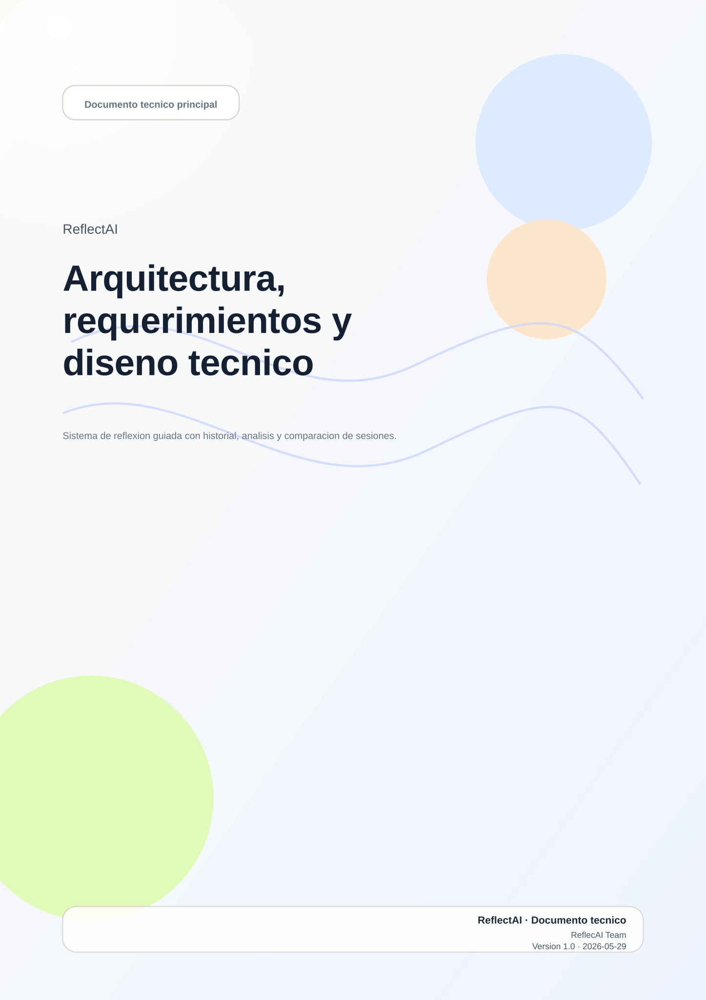

= Proyecto ReflectAI: Documentación Técnica
:author: ReflecAI Team
:revnumber: 1.0
:revdate: 2026-05-29
:doctype: book
:notitle:
:toc: macro
:toclevels: 3
:sectnums:
:sectanchors:
:chapter-label: 
:pdf-theme: {docdir}/../theme.yml
:icons: font
:imagesdir: {docdir}

<<<

toc::[]

= Introducción

Este documento presenta una visión completa y ordenada del sistema ReflectAI, centrado en la reflexión guiada y el análisis del progreso personal. Aquí se define el alcance del producto, se precisan los requisitos funcionales y no funcionales, y se establece la base técnica que guía el diseño y la implementación.

El objetivo es que el lector entienda qué problema resuelve ReflectAI, cuáles son sus capacidades principales y qué restricciones orientan el desarrollo. Además, se exponen los componentes arquitectónicos y las decisiones que justifican el stack elegido, con el fin de mantener coherencia entre el diseño, la implementación y las metas académicas del proyecto.

La estructura del documento está organizada por contexto: primero se presenta el alcance y los requisitos, luego el diseño técnico y el flujo de preguntas, y finalmente las decisiones arquitectónicas. Esta secuencia permite leer de forma progresiva, desde el problema y la necesidad hasta la solución propuesta.

== Requerimientos
:leveloffset: +1
include::requirements.adoc[]
:leveloffset: -1

== Diseño
:leveloffset: +1
include::design.adoc[]
:leveloffset: -1

== Flujo de preguntas
:leveloffset: +1
include::questions-flow.adoc[]
:leveloffset: -1

== Decisiones arquitectonicas
:leveloffset: +1
include::architecture-decisions.adoc[]
:leveloffset: -1